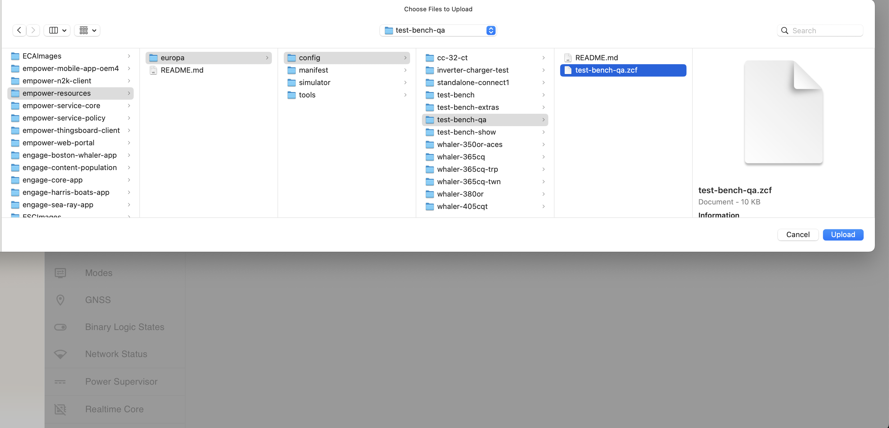
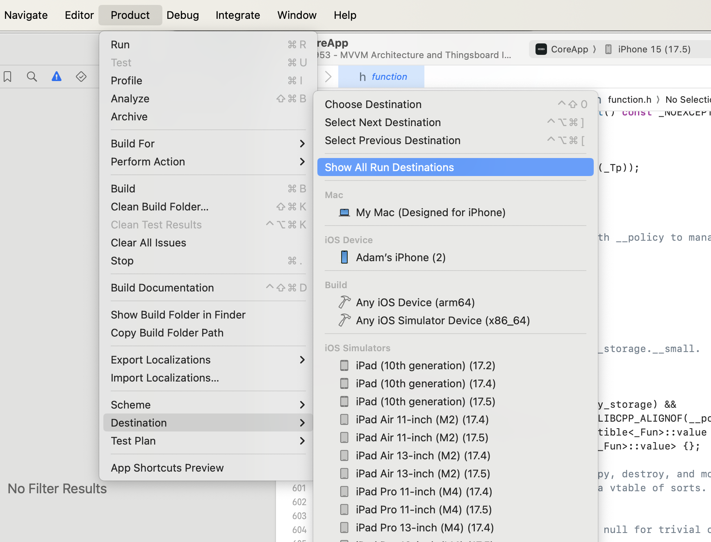
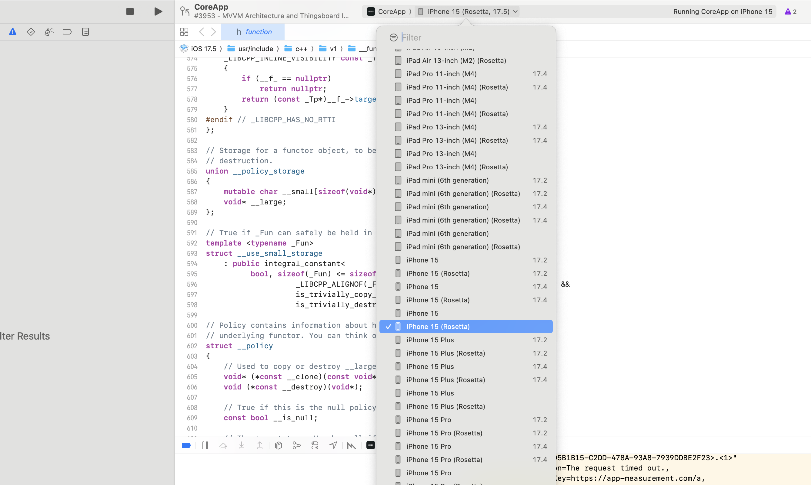
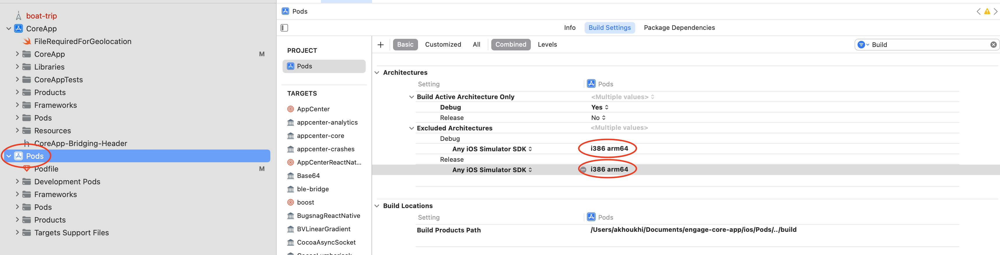

# Engage-Core-App Set Up Guide (iOS M1):

## 1. Install XCode, VSC and Node:
  - Node: https://nodejs.org/en/download/ 
  - VSC: https://code.visualstudio.com/download
  - XCode: From the App Store
### Install NVM (recommended):
  - Link to install: https://github.com/nvm-sh/nvm#install--update-script
  - Note: Incase npm-related issues arise, utilize nvm to downgrade to node v18.8.0
  ```
    nvm install 18.8.0
    nvm use 18.8.0
    node --version
  ```
## 2. Clone repo
  - Repo link: https://github.com/NavicoGroup/engage-core-app
  - You can clone using HTTPS or SSH (recommended):
    Good guide for cloning using SSH: https://phoenixnap.com/kb/git-clone-ssh
## 3. Azure DevOps Personal Token:
  Navigate to Azure Devops: https://dev.azure.com/bconline
  <br/>
  <br/>
  Create a Personal Access token:
  <br/>
  <br/>
    Good guide for creating a PAT: https://learn.microsoft.com/en-us/azure/devops/organizations/accounts/use-personal-access-tokens-to-authenticate
    <br/>
    Your PAT should have a Full access Scope. Don't forget to save your generated PAT in some secure file.
  <br/>
  <br/>
  Run this command and enter your PAT when prompted to:
  ```
  node -e "require('readline') .createInterface({input:process.stdin,output:process.stdout,historySize:0}) .question('PAT> ',p => { b64=Buffer.from(p.trim()).toString('base64');console.log(b64);process.exit(); })"
  ```
  Save the output in some secure file. The output is the encoded version of your PAT. Both the encoded and decoded (original) versions will be used 
  <br/>
  <br/>
## 4. Set up the Enviroment Variables
  You will need to set up two enviroment variables: Good guide on env vars (https://phoenixnap.com/kb/set-environment-variable-mac)
  <br/>
  <br/>
NPM_USER=(The username part of your email addres (i.e. Adam.Khoukhi@navicogroup.com -> Adam.Khoukhi)
<br/><br/>
NPM_PASS=(The encoded PAT generated previously)
  <br/><br/>
  To know if you have successfully added the env vars:
  <br/>
  <br/>
  Run the command:
  
  ```
  env | grep NPM   
  ```

  The output should look something like:
  
  ```
  NPM_USER=Adam.Khoukhi
  NPM_PASS=dTZxZHpkYXVpZTVpZXN1MnJtY3FjbnZ6aXd4enV4aXZmcm92cHY0aGR5NXFzaXZjaGducQ==
  ```
### Troubleshooting
  If you are having trouble adding the env vars then follow the steps below:
  <br/>
  1. Run the command:
     ```
     sudo nano ~/.bash_profile
     ```
  2. Inside Add the following lines and save:
     ```
     export NPM_USER=<Your username>
     export NPM_PASS=<Your encoded PAT>
     ```
  3. Run the command:
     ```
      source ~/.bash_profile
     ```
  ## Note:
  In future steps, make sure that the env variables are present by running the following command in your terminal:
  <br/>
     ```
      source ~/.bash_profile
     ```
## 5. Running Yarn
  Open a terminal in VSC and inside the `engage-core-app` run the command `yarn`.
  ### Troubleshooting
  #### Error:
  ```
    Error: Failed to replace env in config: {NPM_USER}
  ```
  #### Fix:
  Run the command:
     ```
       source ~/.bash_profile
     ```
  #### Error:
  ```
    Error: /Users/akhoukhi/Documents/engage-core-app/node_modules/realm: Command failed.
    Exit code: 127
    ...
    Output:
    prebuild-install warn install unable to get local issuer certificate
  ```
  #### Fix:
  Try downgrading your node version to 18.8 then re-executing `yarn`:
  ```
    nvm install 18.8.0
    nvm use 18.8.0
    node --version
  ```
  If that doesn't resolve it, try executing the command below then re-executing `yarn`:
  ```
    npm set strict-ssl=false
  ```
  If that also doesn't work, try executing `yarn` using the command below:
  ```
  NODE_TLS_REJECT_UNAUTHORIZED=0 yarn
  ```
## 6. BLE setup
  - Install the Azure CLI by executing the following command:
<code>brew update && brew install azure-cli</code>.

  - Login with Azure CLI by executig the following commands:
    - <code>az login</code> and complete the authentication process
    - <code>az devOps login --organization https://dev.azure.com/bconline</code>
and provide your personal access token when requested. The personal access token is the NPM token(Without encoding base64).

  - Install azure universal package using `gem install 'cocoapods-azure-universal-packages'`
  - Execute the command <code>pod install</code>.
  Once yarn is complete, navigate to the `ios` folder and execute the command `pod install`
  ### Troubleshooting
  #### Error:
  ```
    zsh: command not found: pod
  ```
  #### Fix:
  Install pod
     ```
          sudo gem install cocoapods
      ```
 
  #### Error:
  ```
    Error loading plugin file  '/Library/Ruby/Gems/2.6.0/gems/cocoapods-azure-universal-packages-0.1.0/lib/cocoapods_plugin.rb'.

    Gem::ConflictError - Unable to activate cocoapods-azure-universal-packages-0.1.0, because cocoapods-downloader-2.0 conflicts with cocoapods-downloader (~> 1.0)

    Your Podfile requires that the plugin 'cocoapods-azure-universal-packages' be installed. Please install it and try installation again.
  ```
  #### Fix:
  Run the commands:
  
     
        sudo gem uninstall jazzy --all --executables
        
        sudo gem uninstall cocoapods --all --executables
        
        sudo gem uninstall cocoapods-core --all --executables
        
        sudo gem uninstall cocoapods-downloader --all --executables
      
     
  Then the commands:
  
     
        sudo gem install cocoapods-core -v 1.12.1
        
        sudo gem install cocoapods -v 1.12.1
        
        sudo gem install cocoapods-downloader -v 1.6.3
        
        sudo gem install jazzy
        
        sudo gem install cocoapods-azure-universal-packages 
        
    
  
  #### Error:
  ```
    Cloning spec repo `navicogroup-engage-ios-podspecs-1` from `https://github.com/NavicoGroup/engage-ios-podspecs`
    [!] Unable to add a source with url `https://github.com/NavicoGroup/engage-ios-podspecs` named `navicogroup-engage-ios-podspecs-1`.
    You can try adding it manually in `/Users/akhoukhi/.cocoapods/repos` or via `pod repo add`.
  ```
  #### Fix:
  Try adding manually:
  
     
       pod repo add navicogroup-engage-ios-podspecs git@github.com:NavicoGroup/engage-ios-podspecs.git
     
     
  If that doesn't work, navigate to the  `Podfile`:
  - Replace
    ```  
      source 'https://github.com/NavicoGroup/engage-ios-podspecs'
    ```
  - With
    ```
      source 'git@github.com:NavicoGroup/engage-ios-podspecs.git'
    ```

  #### Error:
  ```
    [!] Error installing EngageBleCore
    [!] /opt/homebrew/bin/az artifacts universal download --organization https://dev.azure.com/bconline --feed MobileAppDevelopment --name engage-ios-ble-core --version 0.0.27 --path /var/folders/g7/k20kctg9615c9ynpz30p9k500000gn/T/d20240117-22914-2znfjr --project ASG --scope project
    ...
  
    OSError: [Errno 86] Bad CPU type in executable: '/Users/akhoukhi/.azure/azuredevops/cli/tools/artifacttool/ArtifactTool_osx-x64_0.2.300/artifacttool'
    To check existing issues, please visit: https://github.com/Azure/azure-cli/issues
  ```
  #### Fix:
  Install and use Rosetta
    <br/>
    
  1. In Finder, navigate to the  `Terminal` Application
  
  2. Right-Click the application and click on `Get Info`

  3. Inside the General category, check the `Open using Rosetta` option
  
  4. Open a new Terminal
  
  5. Run the commands:
    
     ```  
       sudo gem uninstall cocoapods --all --executables

       sudo gem install cocoapods -v 1.12.1

       softwareupdate --install-rosetta

       pod install
     
     ```
  #### Error:
  ```
    Installing glog (0.3.5)
    [!] /bin/bash -c 
    set -e
    #!/bin/bash
    ...

    checking whether the C compiler works... no
    xcrun: error: SDK "iphoneos" cannot be located
    xcrun: error: SDK "iphoneos" cannot be located
    xcrun: error: SDK "iphoneos" cannot be located
    xcrun: error: unable to lookup item 'Path' in SDK 'iphoneos'
    ...

    configure: error: C compiler cannot create executables
    See `config.log' for more details
    
  ```
  #### Fix:
  1. Launch XCode
  2. On the top bar, click on `XCode` then `Settings`
  3. Navigate to `Locations`
  4. Make sure there's a dropdown option selected for the command line tools
  5. NOTE: Even if you're seeing Command Line Tools dropdown being selected with proper version, you might want to re-select it again.
  6. To know if successful, the light text underneath the Command Line Tools dropdown should say `/Applications/Xcode.app`

## ThingsBoard Set up
   ** Under maintenance**
   1. **Clone the repo:** https://github.com/NavicoGroup/empower-n2k-client
   2. Open on VSC and open a new terminal session
   3. Execute the following block in the terminal
      ```
      python3 -m venv .venv

      source .venv/bin/activate

      .venv/bin/python3 -m pip install --upgrade pip

      pip install setuptools wheel

      .venv/bin/python setup.py sdist bdist_wheel
      ```
   4. Inside your **Desktop** folder, create a yaml file named **docker-compose**
   5. Add the following content to it
      ```
      version: "3.0"
      services:
      mytb:
        restart: always
        image: "thingsboard/tb-postgres"
        ports:
            - "8080:9090"
            - "1883:1883"
            - "7070:7070"
            - "5683-5688:5683-5688/udp"
        environment:
            TB_QUEUE_TYPE: in-memory
        volumes:
            - /Users/<username>/mytb-data:/data
            - /Users/<username>/mytb-logs:/var/log/thingsboard
      ```
   6. Open a new terminal and navigate to **Desktop**: `cd Desktop`
   7. Execute the following
      ```
      mkdir -p ~/.mytb-data && sudo chown -R 799:799 ~/.mytb-data
      
      mkdir -p ~/.mytb-logs && sudo chown -R 799:799 ~/.mytb-logs
      
      docker compose up --build -d
      ```
   8. **Clone the repo:** https://github.com/NavicoGroup/empower-thingsboard-client
   9. Open on VSC and open a new terminal session
   10. Execute the command `python3 -m venv .venv`
   11. Execute the command `pip3 install -r client/requirements.txt`
   12. Contact Rahul or Adam to complete set-up

## Europa Simulator (recommended)
  1. **Clone the repo:** https://github.com/NavicoGroup/empower-resources
  2. Open on VSC and open a new terminal session
  3. Navigate to the simulator directory: **cd europa -> cd simulator**
  4. Execute the command `pip3 install iotedgedev`
  5. Execute the command `docker compose up --build -d`
     #### Error:
     EuropaSimulator Error Head "https://crasgsharednneu01.azurecr.i...
     UNAUTHORIZED

     #### Fix:
     Execute the command `docker login crasgsharednneu01.azurecr.io`
     
     Request for the login credentials from Tony
  6. If successful, there should be a new docker container running labeled **simulator**
  7. You can now access the Europa Simulator at **http://localhost:9080**
  8. Upload a Configuration
     a. Click on the **settings** icon on the top right corner
     
     b. Select **Upload Configuration**
     
     c. Select **Choose file**
     
     d. Navigate to the empower-resources repo you cloned earlier
     
     c. Select **europa -> config -> test-bench-qa -> test-bench-qa.zcf**
         

## Congratulations! You are all set up!

## To run the App:

1. Run the command:
   ```
   npx react-native run-ios
   ```
2. You may also run the app via `XCode`
3. If you are on M1 or M2 chip, then you will need to run on a **Rosetta** simulator.
   #### Rosetta Simulator
   1. **Product -> Destination -> Show All Run Destinations**
      
   3. Select a **Rosetta** Simulator
      
   
   
   
### Troubleshooting

  #### Error:
  If you are a Mac user (Apple Silicon), and the build fails with a Linker error:

  #### Fix:
  1. Open XCode
  2. Inside the Pods `xcodeproj`, add `arm64` to the `Excluded Architectures`
     
  3. Once done, re-run the commands below

    yarn

    cd ios
    
    pod install
    
    cd ..
    
    npx react-native run-ios

  #### Error:
  If your npx react-native run-ios fails with this error when building
  ```
The following build commands failed:
        PhaseScriptExecution Start\ Packager /Users/stevenrentas/Library/Developer/Xcode/DerivedData/CoreApp-cecazlvviewallelvcwemxcuxpyw/Build/Intermediates.noindex/CoreApp.build/Debug-iphonesimulator/CoreApp.build/Script-FD10A7F022414F080027D42C.sh (in target 'CoreApp' from project 'CoreApp')
(1 failure)

  ```
  #### Fix:
  Navigate to XCode -> CoreApp Target -> Build Phases
  1) Click on the trash icon next to the phase titled "Start Packager"
  2) Run the command: `npx react-native run-ios`
  3) Using the git version control utility on VSC, undo the deletion by reverting the respective lines in `project.pbxproj`
  4) Run the command: `npx react-native run-ios`

  #### Error:
  If your login fails with an API error or something as shown below:
  ```
  [CodePush] Network request failed


  2024-01-18T14:41:20.814Z | REALM | ERROR | Could not login api-key based Realm user AppError: Network request failed {"name":"AppError","logs":"","code":"CustomError"}

  ```
  #### Fix:
  Try turning off `GlobalProtect` and `ZScaler` to fix it.
  

## Android Set up
  ** Under maintenance**
  1. Install **Android Studio:** https://developer.android.com/studio
  2. Download JRE: https://www.java.com/en/download/
  3. Install jdk 17 `brew install --cask zulu17`
  4. Run the commands:
     ```
     brew install --cask android-sdk
     
     brew install --cask android-platform-tools
     ```
  5. Open Android Studio and build gradle
  6. Check that the jdk version is set to 17, if not, set it to 17
  7. Run `yarn android`

  
  
  
      
    
